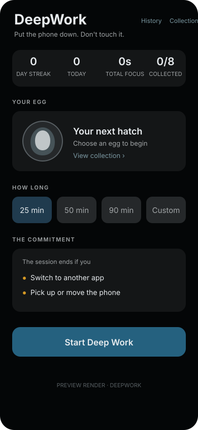
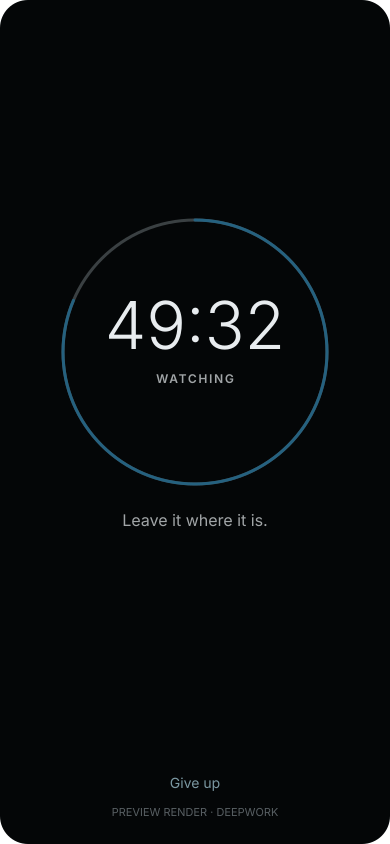
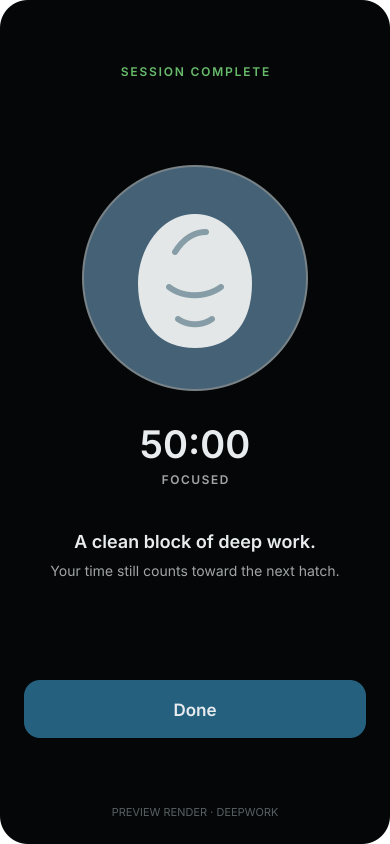

# DeepWork

<p align="center">
  <strong>Put the phone down. Don't touch it.</strong><br>
  A focus timer that treats picking up the phone as a real failure condition.
</p>

<p align="center">
  
  
  
</p>

> The images above are static preview renders based on the UIKit implementation.
> They are included to show the product flow; they are not captured simulator
> screenshots.

DeepWork is a local-first UIKit focus app for iPhone and iPad. Choose a
duration, put the device down, and let the session run. Switching apps or
moving the phone ends the session and records the result honestly.

## Why DeepWork

Most timers measure elapsed time, even when the user has already left the
session. DeepWork makes the commitment explicit: the session is active only
while the app stays in the foreground and the phone stays where it was placed.

## Features

- Motion-based lift detection with a short calibration period
- Foreground/background failure detection
- Monotonic session timing that is not affected by wall-clock changes
- Local JSON persistence for history and derived statistics
- Egg incubation and creature collection tied to focused time
- Light and dark mode support
- Unit tests for the detector, persistence, and session rules
- UI tests for the launch flow

## Requirements

- macOS with Xcode 16 or later
- iOS 17.0 or later
- An Apple Developer account only for running on a physical device

## Getting started

1. Clone the repository and open `DeepWork.xcodeproj` in Xcode.
2. Select the `DeepWork` scheme and choose an iOS simulator or device.
3. In **Signing & Capabilities**, select your own Team and change the bundle
   identifier if you plan to install or distribute the app.
4. Build and run.

There is no server, account, network connection, CloudKit container, or
third-party dependency.

## How it works

```text
Choose duration
      ↓
Calibrate resting position
      ↓
Monitor foreground + device motion
      ├── app switch / phone lift → failed session
      └── duration reached         → completed session
                                      ↓
                              local history + hatch progress
```

The motion hardware is isolated in `MotionMonitor`. The decision about what
counts as a lift lives in `LiftDetector`, which keeps the core behavior pure and
testable without a device. `SessionEngine` owns the lifecycle and routes every
terminal state through one cleanup path.

## Testing

Run the `DeepWork` scheme's tests in Xcode, or from the repository root:

```sh
xcodebuild test -project DeepWork.xcodeproj -scheme DeepWork \
  -destination 'platform=iOS Simulator,name=iPhone 17'
```

If that simulator is not installed, choose any available iOS simulator in
Xcode or replace the destination name in the command.

## Project structure

```text
DeepWork/
├── Engine/       Motion sampling, lift detection, and session orchestration
├── Models/       Session records, persistence, and collection data
└── Views/        UIKit screens and reusable UI components
docs/screenshots/ README preview renders
DeepWorkTests/    Unit tests
DeepWorkUITests/  UI tests
```

## Privacy

DeepWork does not collect or transmit personal data. Session records are saved
in the app's Application Support directory on the device. Motion samples are
processed locally and are not persisted.

## Contributing

Bug fixes, tests, documentation improvements, and focused features are
welcome. Please read [CONTRIBUTING.md](CONTRIBUTING.md) before opening a pull
request.

## License

DeepWork is available under the [Apache License 2.0](LICENSE).
